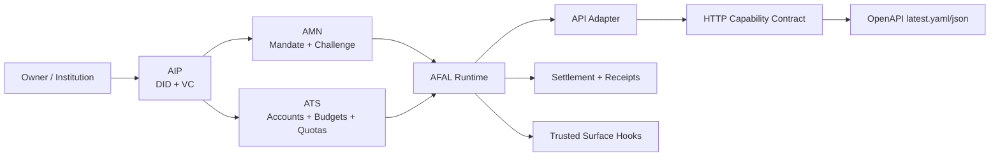
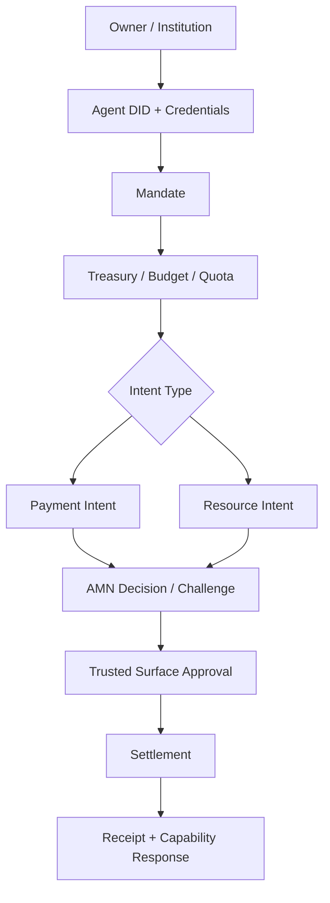

# AFAL — Agent Financial Action Layer

AFAL is a Web4 financial action layer for agent-native identity, authority, treasury, payments, resource settlement, and future market access.

AFAL is composed of:
- **AIP** — Agent Identity Passport
- **AMN** — Agent Mandate Network
- **ATS** — Agent Treasury Stack

Together, these modules form the substrate for agent financial actions across payments, resource settlement, and future crypto-native trading.

## Current Status

AFAL is no longer just a whitepaper or schema set.

Current stage:
- **Phase 1 durable async execution skeleton**
- docs/specs/contracts are frozen enough to demo
- AIP / ATS / AMN / AFAL runtime all run in seeded durable local mode
- top-level approval requests, trusted-surface callback persistence, and post-approval resume-to-settlement are all wired end to end

The repo now includes:
- frozen Phase 1 schemas and canonical examples
- shared SDK types and fixtures
- seeded storage-backed AIP, ATS, and AMN module skeletons
- AFAL runtime, API adapter, and HTTP transport contract
- persistent approval sessions with trusted-surface callback and resume routes
- top-level `pending-approval` capability entrypoints for payment and resource requests
- AFAL-level `resume-approved-action` execution for post-approval settlement and receipt completion
- local durable mode backed by JSON file stores
- OpenAPI draft, stable publish artifacts, snapshot releases, and preview UI
- automated verification across runtime, API, HTTP, OpenAPI export, and durable persistence

Current validated state:
- `npm run typecheck` passes
- `npm run test:mock` passes
- the test suite currently contains `112` passing tests
- both canonical flows run in:
  - seeded in-memory mode
  - seeded local durable mode
  - durable HTTP mode

## Quickstart

If you only want the fastest path to verify and demo the repo, run:

```bash
npm run accept:local
```

If your environment cannot open local ports, use:

```bash
npm run accept:local -- --skip-http
```

Equivalent manual flow:

```bash
npm run typecheck
npm run test:mock
npm run demo:durable
npm run demo:http-async
npm run demo:http-payment
npm run export:openapi
```

If you want to show the local HTTP capability surface:

```bash
npm run serve:durable-http
```

Then open a second terminal and send a request:

```bash
curl -X POST http://127.0.0.1:3212/capabilities/execute-payment \
  -H 'content-type: application/json' \
  -d @docs/examples/http/execute-payment.request.json
```

For contract review:

```bash
npm run preview:openapi
```

Then open:
- `http://127.0.0.1:3210`

## What AFAL Is Building

Before building full agent trading venues or consumer-facing wallets, AFAL focuses on the foundational substrate for:

1. agent identity
2. agent authority
3. agent accounts and treasury
4. payment and resource settlement
5. later: trade intents and venue access

Phase 1 focuses on:
- Owner DID
- Institution DID
- Agent DID
- Ownership Credential
- KYC/KYB Credential
- Authority Credential
- Policy Credential
- account and treasury model
- payment intent
- resource intent
- stablecoin settlement hooks
- challenge and trusted-surface hooks
- approval session persistence and recovery

## Architecture At A Glance



## Canonical Phase 1 Flows



Canonical examples:
- [docs/examples/mvp-agent-payment-flow.md](docs/examples/mvp-agent-payment-flow.md)
- [docs/examples/mvp-resource-settlement-flow.md](docs/examples/mvp-resource-settlement-flow.md)

## What Exists Today

| Area | Current State |
| --- | --- |
| Docs and specs | Phase 1 schemas, examples, architecture docs, roadmap, whitepaper |
| AIP | storage-backed skeleton, API adapter, JSON durable store |
| ATS | storage-backed skeleton, API adapter, JSON durable store, reservation/hold/release semantics |
| AMN | storage-backed skeleton, API adapter, JSON durable store, approval-session persistence and recovery |
| AFAL runtime | seeded runtime, durable runtime, intent state, settlement, outputs |
| HTTP surface | framework-free router, durable HTTP wiring, thin Node server shell |
| OpenAPI | draft YAML, stable latest YAML/JSON, manifest, preview, snapshots |
| Testing | runtime, durable persistence, API, HTTP, export, preview, snapshot tests |

## What Is Real vs. What Is Still Stubbed

Already real in local development terms:
- module boundaries and type surfaces
- store/service separation
- durable local persistence through JSON file stores
- persistent approval sessions and resumable trusted-surface state transitions
- persisted pending executions that can resume approved actions into settlement and receipts
- state transitions for identity, budget, mandate, intent, settlement, and receipts
- HTTP capability routing and OpenAPI publication pipeline

Still intentionally not production-real:
- real database backend
- real stablecoin settlement integration
- real provider usage and billing integration
- real trusted-surface callback handling across independent deployed services
- real chain contracts and anchoring
- production auth, deployment, observability, and multi-tenant operations

## How To Run The Project

### Verify Everything

```bash
npm run typecheck
npm run test:mock
npm run accept:local
```

### Run The Canonical Demos

```bash
npm run demo:mock
npm run demo:durable
npm run demo:http
npm run demo:http-async
npm run demo:http-payment
npm run demo:http-resource
```

What these do:
- `demo:mock` runs the payment and resource flows in seeded in-memory mode
- `demo:durable` runs the same flows in seeded local durable mode and writes state to `.afal-durable-data/`
- `demo:http` starts the durable HTTP server, sends the canonical payment request, compares the response with the sample file, and prints the response
- `demo:http-async` runs the async payment path end to end: request approval, apply approval result, then resume the approved action into settlement
- `demo:http-payment` runs the canonical payment request through the durable HTTP layer and writes state to `.afal-durable-http-data/`
- `demo:http-resource` starts the durable HTTP server, sends the canonical resource request, compares the response with the sample file, and prints the response

### Run The Local Durable HTTP Server

```bash
npm run serve:durable-http
```

Default runtime settings:
- host: `127.0.0.1`
- port: `3212`
- data dir: `.afal-durable-http-data/`

You can also run the underlying TypeScript entry directly and override values:

```bash
node --import tsx/esm backend/afal/http/durable-server.ts ./tmp/afal-http-data 127.0.0.1 3212
```

### Publish And Preview OpenAPI Artifacts

```bash
npm run export:openapi
npm run preview:openapi
npm run snapshot:openapi -- 0.1.0
```

Stable OpenAPI artifacts:
- [`docs/specs/openapi/latest.yaml`](docs/specs/openapi/latest.yaml)
- [`docs/specs/openapi/latest.json`](docs/specs/openapi/latest.json)
- [`docs/specs/openapi/manifest.json`](docs/specs/openapi/manifest.json)

## Complete Validation Workflow

If you want the full repo-level validation path, run the commands in this order.

One-command version:

```bash
npm run accept:local
```

Restricted-environment version:

```bash
npm run accept:local -- --skip-http
```

### 1. Static Type Validation

```bash
npm run typecheck
```

This checks the current TypeScript surfaces across `backend/` and `sdk/`.

### 2. Full Automated Test Suite

```bash
npm run test:mock
```

This covers:
- AIP service, API, and durable file store
- ATS service, API, and durable file store
- AMN service, API, and durable file store
- AFAL state, settlement, outputs, runtime, and durable runtime
- AFAL mock orchestration
- AFAL API adapter
- AFAL HTTP router
- durable HTTP router
- durable HTTP server adapter
- durable HTTP payment demo
- OpenAPI export, preview, and snapshot checks

Current validated result:
- `112` tests passing

### 3. Demo-Level Runtime Checks

```bash
npm run demo:mock
npm run demo:durable
npm run demo:http-async
npm run demo:http-payment
```

What each command proves:
- `demo:mock` proves the canonical payment and resource flows run in seeded in-memory mode
- `demo:durable` proves the same flows run in seeded local durable mode and persist state under `.afal-durable-data/`
- `demo:http-async` proves the async approval chain works through the HTTP layer: pending approval, callback application, and resumed settlement
- `demo:http-payment` proves the canonical payment request runs through the durable HTTP layer and writes durable state under `.afal-durable-http-data/`

### 4. Local HTTP Capability Check

Start the local server:

```bash
npm run serve:durable-http
```

Then, in another terminal, send a payment request:

```bash
curl -X POST http://127.0.0.1:3212/capabilities/request-payment-approval \
  -H 'content-type: application/json' \
  -d @docs/examples/http/request-payment-approval.request.json
```

Canonical request bodies live here:
- [`docs/examples/http/request-payment-approval.request.json`](docs/examples/http/request-payment-approval.request.json)
- [`docs/examples/http/request-payment-approval.response.sample.json`](docs/examples/http/request-payment-approval.response.sample.json)
- [`docs/examples/http/execute-payment.request.json`](docs/examples/http/execute-payment.request.json)
- [`docs/examples/http/execute-payment.response.sample.json`](docs/examples/http/execute-payment.response.sample.json)
- [`docs/examples/http/execute-payment.bad-request.response.sample.json`](docs/examples/http/execute-payment.bad-request.response.sample.json)
- [`docs/examples/http/execute-payment.authorization-expired.response.sample.json`](docs/examples/http/execute-payment.authorization-expired.response.sample.json)
- [`docs/examples/http/execute-payment.authorization-rejected.response.sample.json`](docs/examples/http/execute-payment.authorization-rejected.response.sample.json)
- [`docs/examples/http/resume-approved-action.request.json`](docs/examples/http/resume-approved-action.request.json)
- [`docs/examples/http/resume-approved-action.response.sample.json`](docs/examples/http/resume-approved-action.response.sample.json)
- [`docs/examples/http/resume-approved-action.authorization-expired.response.sample.json`](docs/examples/http/resume-approved-action.authorization-expired.response.sample.json)
- [`docs/examples/http/resume-approved-action.authorization-rejected.response.sample.json`](docs/examples/http/resume-approved-action.authorization-rejected.response.sample.json)
- [`docs/examples/http/settle-resource-usage.request.json`](docs/examples/http/settle-resource-usage.request.json)
- [`docs/examples/http/settle-resource-usage.response.sample.json`](docs/examples/http/settle-resource-usage.response.sample.json)
- [`docs/examples/http/settle-resource-usage.provider-failure.response.sample.json`](docs/examples/http/settle-resource-usage.provider-failure.response.sample.json)

### 5. OpenAPI Contract Check

Refresh the generated artifacts:

```bash
npm run export:openapi
```

Preview the stable contract:

```bash
npm run preview:openapi
```

Then open:
- `http://127.0.0.1:3210`

If you want an immutable release snapshot:

```bash
npm run snapshot:openapi -- 0.1.0
```

## Fastest End-to-End Check

If you only want one compact validation pass, run:

```bash
npm run typecheck
npm run test:mock
npm run demo:durable
npm run demo:http
npm run demo:http-async
npm run demo:http-payment
npm run export:openapi
```

## How To Demo AFAL In 10 Minutes

1. Open the canonical flow docs and explain the Phase 1 spine.
   Start with [docs/examples/mvp-agent-payment-flow.md](docs/examples/mvp-agent-payment-flow.md) and [docs/examples/mvp-resource-settlement-flow.md](docs/examples/mvp-resource-settlement-flow.md).

2. Show that the runtime executes the flows.

```bash
npm run demo:durable
npm run demo:http
npm run demo:http-async
npm run demo:http-payment
```

3. Show that AFAL exposes a stable HTTP capability surface.

```bash
npm run serve:durable-http
```

4. Show the async approval entrypoint.

```bash
curl -X POST http://127.0.0.1:3212/capabilities/request-payment-approval \
  -H 'content-type: application/json' \
  -d @docs/examples/http/request-payment-approval.request.json
```

5. Show the post-approval async resume path.

```bash
curl -X POST http://127.0.0.1:3212/approval-sessions/resume-action \
  -H 'content-type: application/json' \
  -d @docs/examples/http/resume-approved-action.request.json
```

6. If you want the scripted version of that same async flow, run:

```bash
npm run demo:http-async
```

7. Show that the contract is published and versioned.
   Open:
   - [docs/specs/openapi/index.html](docs/specs/openapi/index.html)
   - [docs/specs/openapi/versioning-policy.md](docs/specs/openapi/versioning-policy.md)
   - [docs/specs/openapi/releases/v0.1.0/release-notes.md](docs/specs/openapi/releases/v0.1.0/release-notes.md)

## Repository Structure

- `docs/` — whitepaper, architecture, specs, examples, roadmap, references
- `contracts/` — on-chain modules and interface notes
- `backend/` — off-chain services and runtime layers
- `sdk/` — shared types, fixtures, and future client libraries
- `app/` — trusted surface and future app components
- `tasks/` — milestone planning and implementation tracking
- `.github/` — repository collaboration templates

## Contribution Workflow

For local contribution and PR hygiene:
- [`CONTRIBUTING.md`](CONTRIBUTING.md)
- [`.github/pull_request_template.md`](.github/pull_request_template.md)

Default submission check:

```bash
npm run accept:local
```

## Current Runtime Layers

- `backend/aip/` — identity and credential module
- `backend/ats/` — treasury, budgets, and quotas module
- `backend/amn/` — mandate, decision, challenge, and approval module
- `backend/afal/state/` — payment and resource intent state
- `backend/afal/settlement/` — usage and settlement records
- `backend/afal/outputs/` — receipts and capability responses
- `backend/afal/service/` — AFAL runtime and durable runtime wiring
- `backend/afal/api/` — capability request/response adapter
- `backend/afal/http/` — framework-free HTTP contract and durable server shell

## Key Documents

### Core Docs

- [docs/whitepaper/afal-whitepaper-v6.md](docs/whitepaper/afal-whitepaper-v6.md)
- [docs/product/mvp-scope.md](docs/product/mvp-scope.md)
- [docs/product/implementation-roadmap-next-stage.md](docs/product/implementation-roadmap-next-stage.md)
- [tasks/milestone-mvp.md](tasks/milestone-mvp.md)

### Specs And Contracts

- [docs/specs/afal-http-openapi-draft.yaml](docs/specs/afal-http-openapi-draft.yaml)
- [docs/specs/openapi/latest.yaml](docs/specs/openapi/latest.yaml)
- [docs/specs/openapi/latest.json](docs/specs/openapi/latest.json)
- [docs/specs/openapi/manifest.json](docs/specs/openapi/manifest.json)
- [docs/specs/openapi/versioning-policy.md](docs/specs/openapi/versioning-policy.md)

### Example Flows

- [docs/examples/mvp-agent-payment-flow.md](docs/examples/mvp-agent-payment-flow.md)
- [docs/examples/mvp-resource-settlement-flow.md](docs/examples/mvp-resource-settlement-flow.md)

## Current Phase Boundary

AFAL currently demonstrates:
- documentation-first design closure
- schema-first module boundaries
- executable canonical payment and resource flows
- local durable persistence across restarts
- capability-oriented HTTP transport
- versioned OpenAPI publication

AFAL does not yet claim:
- production settlement
- production-grade trusted-surface callbacks
- chain-native enforcement
- market venue execution

That is the next stage after the current seeded durable runtime milestone.
