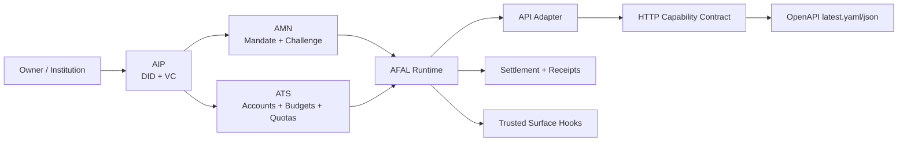
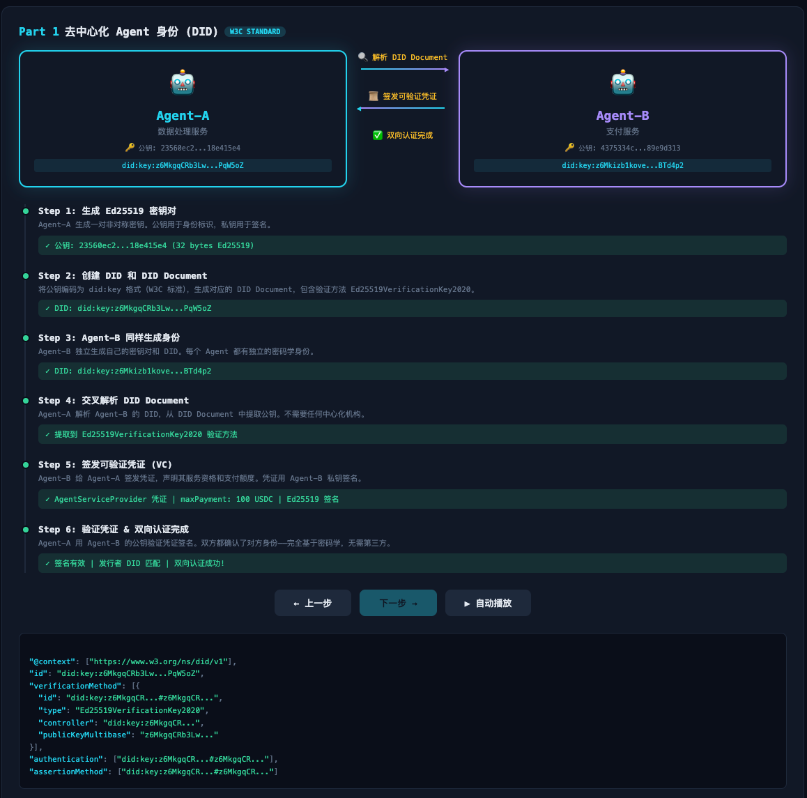
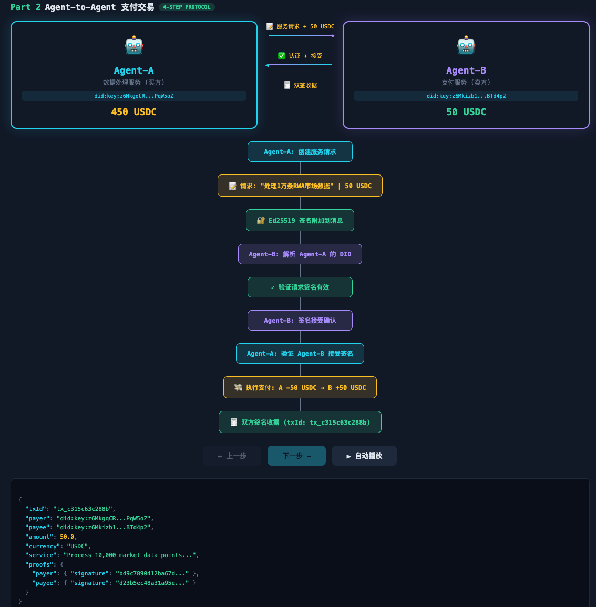

# AFAL — Agent Financial Action Layer

AFAL is a Web4 financial action layer for agent-native identity, authority, treasury, payments, resource settlement, and future market access.

AFAL is composed of:
- **AIP** — Agent Identity Passport
- **AMN** — Agent Mandate Network
- **ATS** — Agent Treasury Stack

Together, these modules form the substrate for agent financial actions across payments, resource settlement, and future crypto-native trading.

## Current Status

AFAL is no longer just a whitepaper or schema set.

Current stage:
- **Late Phase 1 externally integrated runtime, locally accepted**
- docs/specs/contracts are frozen enough to demo
- AIP / ATS / AMN / AFAL runtime all run in seeded durable local mode
- top-level approval requests, trusted-surface callback persistence, and post-approval resume-to-settlement are all wired end to end
- ATS, AMN approval state, AFAL intent state, admin audit, and notification outbox now also run in a seeded SQLite-backed integration mode
- the same SQLite-backed integration slice is now reachable through the AFAL HTTP contract
- bilateral runtime-agent harnesses now drive both payment and resource callback-and-resume flows through independent agent processes
- receiver-side settlement callbacks now have durable outbox records, automatic background redelivery, and dead-letter metadata in the SQLite-backed HTTP slice
- operator-only notification delivery, worker, and admin-audit routes now exist for callback recovery and inspection
- an independent trusted-surface review service now drives approval callback and resume over HTTP
- AFAL now calls independent payment-rail and provider-service stubs over explicit external adapter boundaries
- the external payment/provider path now includes shared-token auth plus signed request metadata placeholders

The repo now includes:
- frozen Phase 1 schemas and canonical examples
- shared SDK types and fixtures
- seeded storage-backed AIP, ATS, and AMN module skeletons
- AFAL runtime, API adapter, and HTTP transport contract
- persistent approval sessions with trusted-surface callback and resume routes
- top-level `pending-approval` capability entrypoints for payment and resource requests
- AFAL-level `resume-approved-action` execution for post-approval settlement and receipt completion
- local durable mode backed by JSON file stores
- initial SQLite-backed integration mode for ATS, AMN approval state, AFAL intent state, admin audit, and notification outbox
- SQLite-backed AFAL HTTP runtime, server shell, demo, and acceptance path
- bilateral runtime-agent harnesses over the SQLite-backed AFAL HTTP contract
- active payee/provider-side callback delivery plus operator-managed notification recovery paths
- sandbox-facing external agent client registry, per-client auth, and provisioning bootstrap
- an OpenRouter-backed real-agent payment pilot over the sandbox-facing AFAL public API
- an OpenRouter-backed real-agent resource pilot over the sandbox-facing AFAL public API
- OpenAPI draft, stable publish artifacts, snapshot releases, and preview UI
- automated verification across runtime, API, HTTP, OpenAPI export, and durable persistence

Current validated state:
- `npm run typecheck` passes
- targeted harness, notification, API, HTTP, and OpenAPI tests pass
- `npm run accept:external-onboarding` passes for the repo-contained second-engineer onboarding path
- `npm run accept:sqlite` passes for the current externally integrated runtime slice
- `npm run accept:external-agent` passes for the current internal real-agent sandbox matrix
- GitHub Actions CI now runs `typecheck`, `test:mock`, and `accept:external-onboarding` on pull requests and pushes to `main`
- branch protection and required-check guidance lives in [docs/product/ci-merge-gate.md](/Users/caizhuoang/Desktop/Dabanc/agent-financial-action-layer/docs/product/ci-merge-gate.md)
- repo-admin setup can be scripted with [scripts/configure-branch-protection.sh](/Users/caizhuoang/Desktop/Dabanc/agent-financial-action-layer/scripts/configure-branch-protection.sh)
- both canonical flows run in:
  - seeded in-memory mode
  - seeded local durable mode
  - durable HTTP mode
  - seeded SQLite integration mode
  - SQLite-backed HTTP integration mode
  - runtime-agent harness modes over SQLite HTTP
  - external-adapter demo modes over the shared SQLite integration database

## Quickstart

If you only want the fastest path to verify and demo the repo, run:

```bash
npm run accept:local
npm run accept:sqlite
```

If your environment cannot open local ports, use:

```bash
npm run accept:local -- --skip-http
npm run accept:sqlite -- --skip-http
```

Equivalent manual flow:

```bash
npm run typecheck
npm run test:mock
npm run demo:durable
npm run demo:sqlite
npm run demo:http-async
npm run demo:http-payment
npm run demo:http-sqlite
npm run demo:agent-payment
npm run demo:agent-payment-bilateral
npm run demo:agent-resource
npm run demo:agent-resource-bilateral
npm run export:openapi
```

If you want to prepare one real external agent sandbox client against the SQLite-backed integration runtime:

```bash
npm run provision:external-agent-sandbox -- \
  --data-dir ./.afal-sqlite-http-data \
  --client-id client-demo-001 \
  --tenant-id tenant-demo-001 \
  --agent-id agent-demo-001 \
  --subject-did did:afal:agent:payment-agent-01 \
  --mandate-refs mnd-0001,mnd-0002 \
  --monetary-budget-refs budg-money-001 \
  --resource-budget-refs budg-res-001 \
  --resource-quota-refs quota-001 \
  --payment-payee-did did:afal:agent:fraud-service-01 \
  --resource-provider-did did:afal:institution:provider-openai
```

For the current standalone pilot kit, one sandbox client is expected to cover both:

- payment requests for `did:afal:agent:payment-agent-01`
- resource requests for the same sandbox subject

That is a deliberate simplification for repo-external onboarding. It keeps the pilot focused on AFAL consumption rather than multi-subject client management.

Once the client is provisioned, callback URLs can be managed over the authenticated sandbox API:

```bash
curl -s http://127.0.0.1:3213/integrations/callbacks/register \
  -H 'content-type: application/json' \
  -H 'x-afal-client-id: client-demo-001' \
  -H 'x-afal-request-timestamp: <iso-timestamp>' \
  -H 'x-afal-request-signature: <sha256-signature>' \
  -d '{
    "requestRef": "req-callback-register-001",
    "input": {
      "paymentSettlementUrl": "http://127.0.0.1:4318/callbacks/action-settled"
    }
  }'
```

If you want to run one real LLM-backed sandbox payment pilot with OpenRouter:

```bash
echo 'OPENROUTER_API_KEY=...' >> .env
npm run demo:openrouter-payment-pilot -- --data-dir ./.afal-openrouter-pilot-data
npm run demo:openrouter-resource-pilot -- --data-dir ./.afal-openrouter-resource-pilot-data
npm run demo:openrouter-payment-callback-recovery-pilot -- --data-dir ./.afal-openrouter-payment-callback-recovery-data
npm run demo:openrouter-resource-callback-recovery-pilot -- --data-dir ./.afal-openrouter-resource-callback-recovery-data
```

These pilots still use canonical payment/resource fixtures, trusted-surface approval, and mock settlement. They do not use real funds.

Useful failure-matrix variants:

```bash
# payment approval rejected
npm run demo:openrouter-payment-pilot -- \
  --data-dir ./.afal-openrouter-payment-rejected-data \
  --approval-result rejected

# resource upstream transient failures that recover through retry
npm run demo:openrouter-resource-pilot -- \
  --data-dir ./.afal-openrouter-resource-retry-data \
  --confirm-usage-failures-before-success 1 \
  --settle-resource-usage-failures-before-success 1

# payment receiver callback fails first, then operator worker redelivers successfully
npm run demo:openrouter-payment-callback-recovery-pilot -- \
  --data-dir ./.afal-openrouter-payment-callback-recovery-data

# resource provider callback fails first, then operator worker redelivers successfully
npm run demo:openrouter-resource-callback-recovery-pilot -- \
  --data-dir ./.afal-openrouter-resource-callback-recovery-data \
  --provider-fail-first-attempts 1
```

Use a fresh `--data-dir` per pilot run if you want fully isolated budget/quota state.

If you want to run the full real external-agent sandbox acceptance matrix:

```bash
npm run accept:external-agent
```

If you want structured JSON evidence for every acceptance scenario:

```bash
npm run accept:external-agent -- --artifacts-root ./.afal-openrouter-acceptance-artifacts
```

If you want to replay the external engineer onboarding path inside this repo before handing off the standalone kit:

```bash
npm run accept:external-onboarding
```

If you want to keep the onboarding smoke outputs, server log, and callback receiver log:

```bash
npm run accept:external-onboarding -- --artifacts-root ./.afal-external-onboarding-artifacts
```

This acceptance currently covers:

- payment happy path
- resource happy path
- payment approval rejected
- resource transient retry recovery
- payment callback recovery
- resource callback recovery

The onboarding smoke command covers the narrower second-engineer command sequence:

- start the SQLite HTTP sandbox with external-client auth enabled
- provision one external client bundle
- start the standalone callback receiver
- register callback URLs
- read callback registration back with `get` and `list`
- submit one payment request and one resource request
- assert both responses stay at `pending-approval`

The repo also now includes a first external pilot kit under:

- [samples/README.md](/Users/caizhuoang/Desktop/Dabanc/agent-financial-action-layer/samples/README.md)
- [standalone-external-agent-pilot/README.md](/Users/caizhuoang/Desktop/Dabanc/agent-financial-action-layer/samples/standalone-external-agent-pilot/README.md)
- [external-engineer-pilot-handoff.md](/Users/caizhuoang/Desktop/Dabanc/agent-financial-action-layer/docs/product/external-engineer-pilot-handoff.md)
- [external-engineer-message-template.md](/Users/caizhuoang/Desktop/Dabanc/agent-financial-action-layer/docs/product/external-engineer-message-template.md)
- [external-pilot-findings-template.md](/Users/caizhuoang/Desktop/Dabanc/agent-financial-action-layer/docs/product/external-pilot-findings-template.md)
- [sdk-boundary-draft.md](/Users/caizhuoang/Desktop/Dabanc/agent-financial-action-layer/docs/product/sdk-boundary-draft.md)

You can now export the standalone pilot as a repo-external consumer skeleton with:

```bash
npm run export:external-agent-pilot
```

Default output:

- `dist/standalone-external-agent-pilot-skeleton/`

You can validate that export path inside this repo with:

```bash
npm run validate:external-agent-pilot-export
```

Reference:

- [external-agent-pilot-export-validation.md](/Users/caizhuoang/Desktop/Dabanc/agent-financial-action-layer/docs/product/external-agent-pilot-export-validation.md)
- [external-agent-pilot-repo-external-runbook.md](/Users/caizhuoang/Desktop/Dabanc/agent-financial-action-layer/docs/product/external-agent-pilot-repo-external-runbook.md)

To convert a provisioning JSON bundle into `.env` text for the external skeleton:

```bash
npm run render:external-agent-bundle-env -- \
  --input /tmp/afal-external-bundle.json \
  --output /tmp/afal-external-agent.env
```

Recommended next validation step:

- hand the standalone pilot kit to a second engineer
- require that they work from a separate repo or separate workspace
- require that they use only AFAL public routes, provisioning output, and published docs

That is the current gate between:

- **internally accepted external-agent sandbox**

and:

- **externally validated external-agent sandbox**

Important current behavior:

- `npm run serve:sqlite-http` now enables external-client auth by default
- this is the correct default for sandbox-facing external engineer testing

If you want to show the local HTTP capability surface:

```bash
npm run serve:durable-http
```

Then open a second terminal and send a request:

```bash
curl -X POST http://127.0.0.1:3212/capabilities/execute-payment \
  -H 'content-type: application/json' \
  -d @docs/examples/http/execute-payment.request.json
```

For contract review:

```bash
npm run preview:openapi
```

Then open:
- `http://127.0.0.1:3210`

## What AFAL Is Building

Before building full agent trading venues or consumer-facing wallets, AFAL focuses on the foundational substrate for:

1. agent identity
2. agent authority
3. agent accounts and treasury
4. payment and resource settlement
5. later: trade intents and venue access

Phase 1 focuses on:
- Owner DID
- Institution DID
- Agent DID
- Ownership Credential
- KYC/KYB Credential
- Authority Credential
- Policy Credential
- account and treasury model
- payment intent
- resource intent
- stablecoin settlement hooks
- challenge and trusted-surface hooks
- approval session persistence and recovery

Phase 1 primary records still use the internal `did:afal:*` namespace, while the docs now also describe a lightweight `did:key + Ed25519 + VC` execution profile for local bootstrap, bilateral authentication, and interop-oriented demos.

## Distribution Outlook

AFAL is now strong enough to justify thinking about a future package or hosted-consumer surface, but not yet strong enough to claim that surface is complete.

The current correct position is:

- the runtime and sandbox boundary are ready for external-engineer pilot validation
- the project is **not yet** at a polished package-distribution or one-command hosted-product stage

What still needs to happen before package-style distribution becomes credible:

- one successful repo-external engineer pilot
- friction fixes in onboarding, env setup, auth, and callback registration
- a stable consumer-facing SDK or package surface
- a clearer separation between implementation repo and consumer kit

The likely future product shapes are:

1. a TypeScript client SDK / package for AFAL public routes
2. a callback receiver starter package
3. a hosted sandbox or managed onboarding flow for agent builders

That direction makes sense for AFAL as AI infrastructure. It is just one stage too early to present the current repo itself as the finished package surface.

While waiting for the first repo-external engineer feedback, use:

- [External Pilot Findings Template](docs/product/external-pilot-findings-template.md)
- [SDK Boundary Draft](docs/product/sdk-boundary-draft.md)

## Architecture At A Glance



## Canonical Phase 1 Flows


Canonical examples:
- [docs/examples/mvp-agent-payment-flow.md](docs/examples/mvp-agent-payment-flow.md)
- [docs/examples/mvp-resource-settlement-flow.md](docs/examples/mvp-resource-settlement-flow.md)

## Demo Snapshots

These two prototype snapshots are useful for communicating the intended AFAL interaction model at a glance:

- `demo1` shows the decentralized agent-to-agent DID handshake and identity verification path
- `demo2` shows the higher-level agent-to-agent payment exchange flow built on signed messages and verified counterparties

<p align="center">
  
  
</p>

## What Exists Today

| Area | Current State |
| --- | --- |
| Docs and specs | Phase 1 schemas, examples, architecture docs, roadmap, whitepaper |
| AIP | storage-backed skeleton, API adapter, JSON durable store |
| ATS | storage-backed skeleton, API adapter, JSON durable store, reservation/hold/release semantics |
| AMN | storage-backed skeleton, API adapter, JSON durable store, SQLite store, approval-session persistence and recovery |
| AFAL runtime | seeded runtime, durable runtime, SQLite integration runtime, intent state, settlement, outputs, payment/resource runtime-agent harnesses, receiver callback outbox and worker control |
| HTTP surface | framework-free router, durable HTTP wiring, SQLite HTTP wiring, thin Node server shells |
| OpenAPI | draft YAML, stable latest YAML/JSON, manifest, preview, snapshots |
| Testing | runtime, durable persistence, API, HTTP, export, preview, snapshot tests |

## What Is Real vs. What Is Still Stubbed

Already real in local development terms:
- module boundaries and type surfaces
- store/service separation
- durable local persistence through JSON file stores
- initial SQLite-backed integration persistence for ATS, AMN approval state, AFAL intent state, admin audit, and notification outbox
- persistent approval sessions and resumable trusted-surface state transitions
- persisted pending executions that can resume approved actions into settlement and receipts
- state transitions for identity, budget, mandate, intent, settlement, and receipts
- HTTP capability routing and OpenAPI publication pipeline
- bilateral runtime-agent harnesses that exercise AFAL through independent subprocess roles
- receiver-side settlement callbacks with durable outbox tracking, worker-driven redelivery, dead-letter metadata, operator auth, and admin audit
- independent trusted-surface review service that approval agents can call over HTTP
- explicit payment-rail and provider-settlement adapter boundaries above AFAL-owned settlement recording
- shared SQLite integration database for ATS, AMN approval state, AFAL intent state, notification outbox, and admin audit
- network-shaped mock payment-rail and provider service stubs that AFAL can call over HTTP
- shared-token auth plus signed request metadata placeholders between AFAL HTTP adapters and the external payment/provider stubs
- bounded retry plus failure classification for transient-vs-terminal external adapter failures

Still intentionally not production-real:
- real database backend
- real stablecoin settlement integration
- real provider usage and billing integration
- real trusted-surface callback handling across independent deployed services beyond the current local stub
- real chain contracts and anchoring
- production auth, deployment, observability, multi-tenant operations, and operator control plane

## How To Run The Project

### Verify Everything

```bash
npm run typecheck
npm run test:mock
npm run accept:local
npm run accept:sqlite
```

### Run The Canonical Demos

```bash
npm run demo:mock
npm run demo:durable
npm run demo:sqlite
npm run demo:http
npm run demo:http-async
npm run demo:http-payment
npm run demo:http-sqlite
npm run demo:agent-payment
npm run demo:agent-payment-bilateral
npm run demo:notification-admin
npm run demo:agent-resource
npm run demo:agent-resource-bilateral
npm run demo:external-adapters
npm run demo:external-adapters-retry
npm run demo:http-resource
```

What these do:
- `demo:mock` runs the payment and resource flows in seeded in-memory mode
- `demo:durable` runs the same flows in seeded local durable mode and writes state to `.afal-durable-data/`
- `demo:sqlite` runs the same flows in the seeded SQLite integration mode and writes a shared `afal-integration.sqlite` plus AFAL settlement/output artifacts under `.afal-sqlite-data/`
- `demo:http` starts the durable HTTP server, sends the canonical payment request, compares the response with the sample file, and prints the response
- `demo:http-async` runs the async payment path end to end: request approval, independent trusted-surface service callback, then resume the approved action into settlement
- `demo:http-payment` runs the canonical payment request through the durable HTTP layer and writes state to `.afal-durable-http-data/`
- `demo:http-sqlite` runs the canonical payment request through the SQLite-backed HTTP layer and writes state to `.afal-sqlite-http-data/`
- `demo:agent-payment` runs the requester-side payment harness over the SQLite-backed HTTP layer: one `payer-agent` creates a pending approval session and one `approval-agent` completes callback-and-resume into settlement
- `demo:agent-payment-bilateral` extends that payment harness with a payee-side callback receiver that actively accepts the final settlement notification after AFAL resumes the approved action
- `demo:notification-admin` runs the payment callback path with an intentionally failed first receiver attempt, then exercises operator-only notification delivery, worker, and admin-audit routes to recover delivery
- `demo:agent-resource` runs the requester-side resource harness for the canonical resource approval flow
- `demo:agent-resource-bilateral` extends that resource harness with a provider-side callback receiver that actively accepts the final usage and settlement notification after AFAL resumes the approved action
- `demo:external-adapters` runs AFAL against independent payment-rail and provider-service stubs over HTTP while persisting integration state in a shared SQLite database
- `demo:external-adapters-retry` runs the same external service path but injects transient upstream failures and proves the HTTP adapters can recover through bounded retries
- `demo:http-resource` starts the durable HTTP server, sends the canonical resource request, compares the response with the sample file, and prints the response

Trusted-surface stub:

```bash
npm run trusted-surface:stub -- --base-url http://127.0.0.1:3212 --approval-session-ref aps-chall-0001
```

Independent trusted-surface service stub:

```bash
npm run trusted-surface:serve -- --afal-base-url http://127.0.0.1:3212
```

### Run The Local Durable HTTP Server

```bash
npm run serve:durable-http
npm run serve:sqlite-http
```

Default runtime settings:
- host: `127.0.0.1`
- port: `3212`
- data dir: `.afal-durable-http-data/`

SQLite integration HTTP settings:
- host: `127.0.0.1`
- port: `3213`
- data dir: `.afal-sqlite-http-data/`

You can also run the underlying TypeScript entry directly and override values:

```bash
node --import tsx/esm backend/afal/http/durable-server.ts ./tmp/afal-http-data 127.0.0.1 3212
```

### Publish And Preview OpenAPI Artifacts

```bash
npm run export:openapi
npm run preview:openapi
npm run snapshot:openapi -- 0.1.0
```

Stable OpenAPI artifacts:
- [`docs/specs/openapi/latest.yaml`](docs/specs/openapi/latest.yaml)
- [`docs/specs/openapi/latest.json`](docs/specs/openapi/latest.json)
- [`docs/specs/openapi/manifest.json`](docs/specs/openapi/manifest.json)

## Complete Validation Workflow

If you want the full repo-level validation path, run the commands in this order.

One-command version:

```bash
npm run accept:local
npm run accept:sqlite
```

Restricted-environment version:

```bash
npm run accept:local -- --skip-http
npm run accept:sqlite -- --skip-http
```

### 1. Static Type Validation

```bash
npm run typecheck
```

This checks the current TypeScript surfaces across `backend/` and `sdk/`.

### 2. Full Automated Test Suite

```bash
npm run test:mock
```

This covers:
- AIP service, API, and durable file store
- ATS service, API, and durable file store
- AMN service, API, and durable file store
- AFAL state, settlement, outputs, runtime, and durable runtime
- AFAL mock orchestration
- AFAL API adapter
- AFAL HTTP router
- durable HTTP router
- durable HTTP server adapter
- durable HTTP payment demo
- OpenAPI export, preview, and snapshot checks

Current validated result:
- `133` tests passing

### 3. Demo-Level Runtime Checks

```bash
npm run demo:mock
npm run demo:durable
npm run demo:http-async
npm run demo:http-payment
```

What each command proves:
- `demo:mock` proves the canonical payment and resource flows run in seeded in-memory mode
- `demo:durable` proves the same flows run in seeded local durable mode and persist state under `.afal-durable-data/`
- `demo:http-async` proves the async approval chain works through the HTTP layer and a separate trusted-surface service: pending approval, callback application, and resumed settlement
- `demo:http-payment` proves the canonical payment request runs through the durable HTTP layer and writes durable state under `.afal-durable-http-data/`

### 4. Local HTTP Capability Check

Start the local server:

```bash
npm run serve:durable-http
```

Then, in another terminal, send a payment request:

```bash
curl -X POST http://127.0.0.1:3212/capabilities/request-payment-approval \
  -H 'content-type: application/json' \
  -d @docs/examples/http/request-payment-approval.request.json
```

Canonical request bodies live here:
- [`docs/examples/http/request-payment-approval.request.json`](docs/examples/http/request-payment-approval.request.json)
- [`docs/examples/http/request-payment-approval.response.sample.json`](docs/examples/http/request-payment-approval.response.sample.json)
- [`docs/examples/http/get-action-status.payment.request.json`](docs/examples/http/get-action-status.payment.request.json)
- [`docs/examples/http/get-action-status.payment.response.sample.json`](docs/examples/http/get-action-status.payment.response.sample.json)
- [`docs/examples/http/get-action-status.resource.request.json`](docs/examples/http/get-action-status.resource.request.json)
- [`docs/examples/http/get-action-status.resource.response.sample.json`](docs/examples/http/get-action-status.resource.response.sample.json)
- [`docs/examples/http/execute-payment.request.json`](docs/examples/http/execute-payment.request.json)
- [`docs/examples/http/execute-payment.response.sample.json`](docs/examples/http/execute-payment.response.sample.json)
- [`docs/examples/http/execute-payment.bad-request.response.sample.json`](docs/examples/http/execute-payment.bad-request.response.sample.json)
- [`docs/examples/http/execute-payment.authorization-expired.response.sample.json`](docs/examples/http/execute-payment.authorization-expired.response.sample.json)
- [`docs/examples/http/execute-payment.authorization-rejected.response.sample.json`](docs/examples/http/execute-payment.authorization-rejected.response.sample.json)
- [`docs/examples/http/execute-payment.external-adapter-unavailable.response.sample.json`](docs/examples/http/execute-payment.external-adapter-unavailable.response.sample.json)
- [`docs/examples/http/execute-payment.external-adapter-rejected.response.sample.json`](docs/examples/http/execute-payment.external-adapter-rejected.response.sample.json)
- [`docs/examples/http/resume-approved-action.request.json`](docs/examples/http/resume-approved-action.request.json)
- [`docs/examples/http/resume-approved-action.response.sample.json`](docs/examples/http/resume-approved-action.response.sample.json)
- [`docs/examples/http/resume-approved-action.authorization-expired.response.sample.json`](docs/examples/http/resume-approved-action.authorization-expired.response.sample.json)
- [`docs/examples/http/resume-approved-action.authorization-rejected.response.sample.json`](docs/examples/http/resume-approved-action.authorization-rejected.response.sample.json)
- [`docs/examples/http/settle-resource-usage.request.json`](docs/examples/http/settle-resource-usage.request.json)
- [`docs/examples/http/settle-resource-usage.response.sample.json`](docs/examples/http/settle-resource-usage.response.sample.json)
- [`docs/examples/http/settle-resource-usage.provider-failure.response.sample.json`](docs/examples/http/settle-resource-usage.provider-failure.response.sample.json)
- [`docs/examples/http/settle-resource-usage.external-adapter-unavailable.response.sample.json`](docs/examples/http/settle-resource-usage.external-adapter-unavailable.response.sample.json)
- [`docs/examples/http/settle-resource-usage.external-adapter-rejected.response.sample.json`](docs/examples/http/settle-resource-usage.external-adapter-rejected.response.sample.json)

### 5. OpenAPI Contract Check

Refresh the generated artifacts:

```bash
npm run export:openapi
```

Preview the stable contract:

```bash
npm run preview:openapi
```

Then open:
- `http://127.0.0.1:3210`

If you want an immutable release snapshot:

```bash
npm run snapshot:openapi -- 0.1.0
```

## Fastest End-to-End Check

If you only want one compact validation pass, run:

```bash
npm run typecheck
npm run test:mock
npm run demo:durable
npm run demo:http
npm run demo:http-async
npm run demo:http-payment
npm run demo:agent-payment
npm run demo:agent-payment-bilateral
npm run demo:notification-admin
npm run demo:agent-resource
npm run demo:agent-resource-bilateral
npm run export:openapi
```

## How To Demo AFAL In 10 Minutes

1. Open the canonical flow docs and explain the Phase 1 spine.
   Start with [docs/examples/mvp-agent-payment-flow.md](docs/examples/mvp-agent-payment-flow.md) and [docs/examples/mvp-resource-settlement-flow.md](docs/examples/mvp-resource-settlement-flow.md).

2. Show that the runtime executes the flows.

```bash
npm run demo:durable
npm run demo:http
npm run demo:http-async
npm run demo:http-payment
npm run demo:agent-payment
npm run demo:agent-resource
```

3. Show that AFAL exposes a stable HTTP capability surface.

```bash
npm run serve:durable-http
```

4. Show the async approval entrypoint.

```bash
curl -X POST http://127.0.0.1:3212/capabilities/request-payment-approval \
  -H 'content-type: application/json' \
  -d @docs/examples/http/request-payment-approval.request.json
```

5. Show the post-approval async resume path.

```bash
curl -X POST http://127.0.0.1:3212/approval-sessions/resume-action \
  -H 'content-type: application/json' \
  -d @docs/examples/http/resume-approved-action.request.json
```

6. If you want the scripted version of that same async flow, run:

```bash
npm run demo:http-async
npm run demo:agent-payment
npm run demo:agent-resource
```

7. Show that the contract is published and versioned.
   Open:
   - [docs/specs/openapi/index.html](docs/specs/openapi/index.html)
   - [docs/specs/openapi/versioning-policy.md](docs/specs/openapi/versioning-policy.md)
   - [docs/specs/openapi/releases/v0.1.0/release-notes.md](docs/specs/openapi/releases/v0.1.0/release-notes.md)

## Repository Structure

- `docs/` — whitepaper, architecture, specs, examples, roadmap, references
- `contracts/` — on-chain modules and interface notes
- `backend/` — off-chain services and runtime layers
- `sdk/` — shared types, fixtures, and future client libraries
- `app/` — trusted surface and future app components
- `tasks/` — milestone planning and implementation tracking
- `.github/` — repository collaboration templates

## Contribution Workflow

For local contribution and PR hygiene:
- [`CONTRIBUTING.md`](CONTRIBUTING.md)
- [`.github/pull_request_template.md`](.github/pull_request_template.md)

Default submission check:

```bash
npm run accept:local
npm run accept:sqlite
```

## Current Runtime Layers

- `backend/aip/` — identity and credential module
- `backend/ats/` — treasury, budgets, and quotas module
- `backend/amn/` — mandate, decision, challenge, and approval module
- `backend/afal/state/` — payment and resource intent state
- `backend/afal/settlement/` — usage and settlement records
- `backend/afal/outputs/` — receipts and capability responses
- `backend/afal/service/` — AFAL runtime and durable runtime wiring
- `backend/afal/api/` — capability request/response adapter
- `backend/afal/http/` — framework-free HTTP contract and durable server shell
- `agents/test-harness/` — bilateral payment/resource runtime-agent harnesses and notification admin demo flows over the AFAL HTTP contract

## Key Documents

### Core Docs

- [docs/whitepaper/afal-whitepaper-v6.md](docs/whitepaper/afal-whitepaper-v6.md)
- [docs/product/mvp-scope.md](docs/product/mvp-scope.md)
- [docs/product/implementation-roadmap-next-stage.md](docs/product/implementation-roadmap-next-stage.md)
- [docs/product/next-stage-integration-plan.md](docs/product/next-stage-integration-plan.md)
- [docs/product/notification-operator-handbook.md](docs/product/notification-operator-handbook.md)
- [docs/product/notification-operator-playbook.md](docs/product/notification-operator-playbook.md)
- [tasks/milestone-mvp.md](tasks/milestone-mvp.md)

### Specs And Contracts

- [docs/specs/afal-http-openapi-draft.yaml](docs/specs/afal-http-openapi-draft.yaml)
- [docs/specs/trusted-surface-callback-contract.md](docs/specs/trusted-surface-callback-contract.md)
- [docs/specs/receiver-settlement-callback-contract.md](docs/specs/receiver-settlement-callback-contract.md)
- [docs/specs/external-service-auth-contract.md](docs/specs/external-service-auth-contract.md)
- [docs/specs/openapi/latest.yaml](docs/specs/openapi/latest.yaml)
- [docs/specs/openapi/latest.json](docs/specs/openapi/latest.json)
- [docs/specs/openapi/manifest.json](docs/specs/openapi/manifest.json)
- [docs/specs/openapi/versioning-policy.md](docs/specs/openapi/versioning-policy.md)
- [agents/test-harness/README.md](agents/test-harness/README.md)

### Example Flows

- [docs/examples/mvp-agent-payment-flow.md](docs/examples/mvp-agent-payment-flow.md)
- [docs/examples/mvp-resource-settlement-flow.md](docs/examples/mvp-resource-settlement-flow.md)

## Current Phase Boundary

AFAL currently demonstrates:
- documentation-first design closure
- schema-first module boundaries
- executable canonical payment and resource flows
- local durable persistence across restarts
- initial SQLite-backed integration persistence for execution-critical state
- capability-oriented HTTP transport
- persistent approval callback and resume semantics
- bilateral runtime-agent orchestration paths over the real HTTP contract
- receiver callback delivery with operator-visible outbox, worker, and admin-audit controls
- versioned OpenAPI publication

AFAL does not yet claim:
- production settlement
- production-grade trusted-surface callbacks
- full operator control plane or hosted dashboards
- chain-native enforcement
- market venue execution

That means the repo has moved beyond the original seeded durable runtime milestone and now sits in a late Phase 1 integration-and-operations slice, still short of production deployment.
