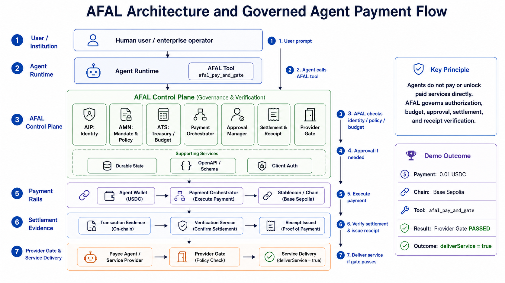

# AFAL Overview

AFAL (Agent Financial Action Layer) is a Web4 financial action layer for agent-native identity, authority, accounts, payments, settlement, and future market access.

Current project stage: early Phase 2 agent payment control-plane preview. AFAL has already passed the Phase 1 external sandbox validation path, and the current live proof point is Claude Code discovering AFAL through MCP, calling `afal_pay_and_gate`, settling a Base Sepolia USDC payment through an agent-wallet rail, and delivering service only after AFAL provider gate returns `deliverService=true`.

## Core Modules

- **AIP (Agent Identity Passport)**  
  Identity and credential substrate for owners, institutions, and agents.

- **AMN (Agent Mandate Network)**  
  Mandates, policy, challenge rules, and trusted-surface authorization.

- **ATS (Agent Treasury Stack)**  
  Smart accounts, budgets, sub-accounts, treasury controls, and resource budgets.

## Design Principles

1. Identity before payments
2. Authority before automation
3. Accounts before trading
4. Payment and resource intents before market access
5. Human challenge for high-risk actions
6. Structured financial actions instead of raw UI automation

## Strategic Direction

AFAL builds DID / VC / account / policy as its own core substrate.

AFAL is inspired by:
- AP2 for mandate / challenge / trusted-surface logic
- token economy for money + compute/resource budgets
- OpenAI’s unified action entry point direction
- Google WebMCP’s structured capability exposure direction
- MCP as a practical agent-tool discovery surface for Claude Code and other agent runtimes

## Phase 1 Scope

- DID / VC / account / mandate / policy
- payment intent
- resource intent
- stablecoin settlement
- trusted-surface hooks

## Current Runtime Proof Points

- SQLite-backed AFAL HTTP sandbox with provisioned external-client auth.
- Receiver callback/outbox, trusted-surface approval, settlement, and receipt state.
- Wallet-confirmed Base Sepolia USDC MetaMask rail with optional JSON-RPC receipt verification.
- Autonomous Base Sepolia USDC agent-wallet rail behind AFAL approval and rail-side max-amount/payee guardrails.
- Provider receipt gate that rejects service delivery unless AFAL reports settled final receipt evidence.
- Claude Code MCP acceptance through `afal_pay_and_gate`.
- GitHub prerelease `afal-payment-mcp-v0.1.0-preview.1` for MCP preview testing.

## Current Non-Claims

- No mainnet payment readiness.
- No production custody, MPC, or smart-account wallet management.
- No production finality policy, asset registry, or RPC provider strategy.
- No full hosted provisioning portal yet.
