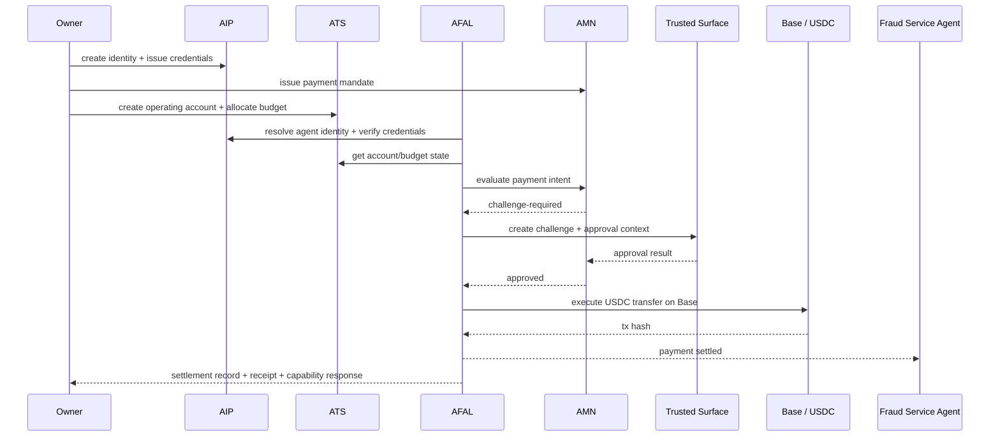

# MVP Agent Payment Flow

## Status
Draft v0.1

## Purpose

This document defines the canonical Phase 1 AFAL MVP scenario:

**agent-to-agent API/tool payment and settlement in USDC on Base**

It is the primary integration spine for Phase 1 implementation.

This example is intentionally concrete. It uses fixed IDs, fixed timestamps, and fixed payload shapes so it can later become:

- backend mock fixtures
- SDK test fixtures
- demo script input/output
- end-to-end orchestration documentation

## Scenario Summary

A merchant-controlled payment agent pays a fraud-detection service agent `45.00 USDC` on Base for one API request.

The action is allowed by identity, mandate, treasury, and policy. Because the service counterparty is being used for the first time, AMN raises a challenge and routes the action through the trusted surface. A human approves it, after which the payment settles and a receipt is produced.

## Why This Is The Canonical Phase 1 Flow

This single scenario exercises the full Phase 1 chain:

```text
Owner/Institution
  -> Agent DID + VC
  -> Payment Mandate
  -> ATS operating account + budget
  -> Payment Intent
  -> AMN challenge / approval
  -> Settlement
  -> Receipt
  -> Capability response
```

It also covers the main architectural requirement from the whitepaper:

- identity before payments
- authority before automation
- accounts before execution
- challenge for high-risk or policy-sensitive actions
- receipts and auditability by default

## Participants

### Human / Governance Side

- Owner: `did:afal:owner:alice-01`
- Institution: `did:afal:institution:merchant-co`

### Acting Agent

- Payment agent: `did:afal:agent:payment-agent-01`
- Operating account: `acct-agent-001`

### Counterparty

- Fraud service agent: `did:afal:agent:fraud-service-01`
- Settlement address: `0xFRAUDSERVICEPAYEE`

### Network / Asset

- Chain: `base`
- Asset: `USDC`

## Module Ownership

| Step | Module | Responsibility |
|---|---|---|
| Identity creation and resolution | AIP | DIDs, bindings, credentials |
| Action permission | AMN | mandate, policy intersection, decision |
| Spend capacity | ATS | account state, budget state |
| Action orchestration | AFAL | payment intent, decision wiring, settlement, receipt |
| Human approval | Trusted Surface | challenge review and approval result |

## Sequence



## Fixed Timeline

- `2026-03-24T12:00:00Z` identity, credentials, mandate, account, budget already active
- `2026-03-24T12:05:00Z` payment intent created
- `2026-03-24T12:05:05Z` AMN returns `challenge-required`
- `2026-03-24T12:07:00Z` owner approves via trusted surface
- `2026-03-24T12:08:00Z` payment executes on Base
- `2026-03-24T12:08:10Z` settlement record finalized
- `2026-03-24T12:08:12Z` receipt and capability response emitted

## Phase 1 Preconditions

The following objects already exist and are active before the payment request starts.

### 1. Owner DID

```json
{
  "id": "did:afal:owner:alice-01",
  "subjectType": "owner",
  "status": "active",
  "controller": ["did:afal:owner:alice-01"],
  "createdAt": "2026-03-24T12:00:00Z",
  "updatedAt": "2026-03-24T12:00:00Z",
  "verificationMethods": [
    {
      "id": "key-1",
      "type": "ed25519",
      "publicKeyMultibase": "z6MkOwnerAlice01"
    }
  ]
}
```

### 2. Institution DID

```json
{
  "id": "did:afal:institution:merchant-co",
  "subjectType": "institution",
  "status": "active",
  "controller": ["did:afal:owner:alice-01"],
  "createdAt": "2026-03-24T12:00:00Z",
  "updatedAt": "2026-03-24T12:00:00Z",
  "verificationMethods": [
    {
      "id": "key-1",
      "type": "ed25519",
      "publicKeyMultibase": "z6MkMerchantCo01"
    }
  ]
}
```

### 3. Agent DID

```json
{
  "id": "did:afal:agent:payment-agent-01",
  "subjectType": "agent",
  "status": "active",
  "controller": ["did:afal:owner:alice-01"],
  "createdAt": "2026-03-24T12:00:00Z",
  "updatedAt": "2026-03-24T12:00:00Z",
  "verificationMethods": [
    {
      "id": "key-1",
      "type": "ed25519",
      "publicKeyMultibase": "z6MkPaymentAgent01"
    }
  ],
  "serviceEndpoints": [
    {
      "id": "primary-api",
      "type": "agent-api",
      "serviceEndpoint": "https://merchant.example/agents/payment-agent-01"
    }
  ]
}
```

### 4. Ownership VC

```json
{
  "id": "cred-own-0001",
  "schemaVersion": "0.1",
  "type": ["VerifiableCredential", "OwnershipCredential"],
  "issuer": "did:afal:institution:merchant-co",
  "issuanceDate": "2026-03-24T12:00:00Z",
  "credentialSubject": {
    "id": "did:afal:agent:payment-agent-01",
    "ownerDid": "did:afal:owner:alice-01",
    "institutionDid": "did:afal:institution:merchant-co",
    "relationshipType": "owns_and_controls",
    "agentType": "payment-agent",
    "environment": "production"
  }
}
```

### 5. KYC / KYB VC

```json
{
  "id": "cred-kyc-0001",
  "schemaVersion": "0.1",
  "type": ["VerifiableCredential", "KycCredential"],
  "issuer": "did:afal:institution:kyc-provider-01",
  "issuanceDate": "2026-03-24T12:00:00Z",
  "credentialSubject": {
    "id": "did:afal:owner:alice-01",
    "kycStatus": "passed",
    "jurisdiction": "HK",
    "riskTier": "low",
    "providerRef": "prov-kyc-001"
  }
}
```

```json
{
  "id": "cred-kyb-0001",
  "schemaVersion": "0.1",
  "type": ["VerifiableCredential", "KybCredential"],
  "issuer": "did:afal:institution:kyb-provider-01",
  "issuanceDate": "2026-03-24T12:00:00Z",
  "credentialSubject": {
    "id": "did:afal:institution:merchant-co",
    "kybStatus": "passed",
    "jurisdiction": "UAE",
    "riskTier": "medium",
    "providerRef": "prov-kyb-101"
  }
}
```

### 6. Authority VC

```json
{
  "id": "cred-auth-0001",
  "schemaVersion": "0.1",
  "type": ["VerifiableCredential", "AuthorityCredential"],
  "issuer": "did:afal:institution:merchant-co",
  "issuanceDate": "2026-03-24T12:00:00Z",
  "credentialSubject": {
    "id": "did:afal:agent:payment-agent-01",
    "authorityClass": "payment-and-resource",
    "allowedActions": [
      "createPaymentIntent",
      "executePayment"
    ],
    "scope": {
      "payments": true,
      "resourceSettlement": false,
      "trading": false
    }
  }
}
```

### 7. Policy VC

```json
{
  "id": "cred-policy-0001",
  "schemaVersion": "0.1",
  "type": ["VerifiableCredential", "PolicyCredential"],
  "issuer": "did:afal:institution:merchant-co",
  "issuanceDate": "2026-03-24T12:00:00Z",
  "credentialSubject": {
    "id": "did:afal:agent:payment-agent-01",
    "singlePaymentLimit": "100.00",
    "dailyPaymentLimit": "1000.00",
    "allowedAssets": ["USDC"],
    "allowedCounterparties": ["did:afal:agent:fraud-service-01"],
    "allowedChains": ["base"],
    "challengeThreshold": "40.00"
  }
}
```

### 8. Payment Mandate

```json
{
  "mandateId": "mnd-0001",
  "schemaVersion": "0.1",
  "mandateType": "payment",
  "issuer": "did:afal:owner:alice-01",
  "subject": "did:afal:agent:payment-agent-01",
  "status": "active",
  "issuedAt": "2026-03-24T12:00:00Z",
  "expiresAt": "2026-04-24T12:00:00Z",
  "scope": {
    "allowedAssets": ["USDC"],
    "allowedCounterparties": ["did:afal:agent:fraud-service-01"],
    "singlePaymentLimit": "100.00",
    "dailyPaymentLimit": "1000.00",
    "allowedChains": ["base"],
    "withdrawalAllowed": false
  },
  "policyRef": "cred-policy-0001",
  "challengeRules": {
    "valueThreshold": "40.00",
    "newCounterpartyRequiresChallenge": true,
    "newAssetRequiresChallenge": true,
    "newVenueRequiresChallenge": false,
    "highResourceUsageRequiresChallenge": false
  }
}
```

### 9. ATS Accounts

```json
{
  "accountId": "acct-treasury-001",
  "schemaVersion": "0.1",
  "accountType": "treasury",
  "status": "active",
  "ownerDid": "did:afal:owner:alice-01",
  "institutionDid": "did:afal:institution:merchant-co",
  "chain": "base",
  "settlementAsset": "USDC",
  "accountAddress": "0xMERCHANTTREASURY01",
  "createdAt": "2026-03-24T12:00:00Z",
  "updatedAt": "2026-03-24T12:00:00Z"
}
```

```json
{
  "accountId": "acct-agent-001",
  "schemaVersion": "0.1",
  "accountType": "operating",
  "status": "active",
  "ownerDid": "did:afal:owner:alice-01",
  "institutionDid": "did:afal:institution:merchant-co",
  "agentDid": "did:afal:agent:payment-agent-01",
  "parentAccountRef": "acct-treasury-001",
  "chain": "base",
  "settlementAsset": "USDC",
  "accountAddress": "0xPAYMENTAGENT01",
  "smartAccount": {
    "standard": "erc-4337-compatible",
    "factoryRef": "acct-factory-base-01"
  },
  "freezeState": {
    "isFrozen": false,
    "reasonCode": null,
    "frozenAt": null
  },
  "createdAt": "2026-03-24T12:00:00Z",
  "updatedAt": "2026-03-24T12:00:00Z"
}
```

### 10. ATS Monetary Budget

```json
{
  "budgetId": "budg-money-001",
  "budgetType": "monetary",
  "subjectDid": "did:afal:agent:payment-agent-01",
  "accountRef": "acct-agent-001",
  "asset": "USDC",
  "period": "daily",
  "limitAmount": "1000.00",
  "consumedAmount": "0.00",
  "availableAmount": "1000.00",
  "status": "active",
  "createdAt": "2026-03-24T12:00:00Z",
  "updatedAt": "2026-03-24T12:00:00Z"
}
```

## Runtime Flow

### Step 1. Create Payment Intent

AFAL receives a request to pay the fraud service for one API call.

```json
{
  "intentId": "payint-0001",
  "schemaVersion": "0.1",
  "intentType": "payment",
  "payer": {
    "agentDid": "did:afal:agent:payment-agent-01",
    "accountId": "acct-agent-001"
  },
  "payee": {
    "payeeDid": "did:afal:agent:fraud-service-01",
    "settlementAddress": "0xFRAUDSERVICEPAYEE"
  },
  "asset": "USDC",
  "amount": "45.00",
  "chain": "base",
  "purpose": {
    "category": "service-payment",
    "description": "fraud detection request #abc123",
    "referenceId": "svc-req-abc123"
  },
  "mandateRef": "mnd-0001",
  "policyRef": "cred-policy-0001",
  "executionMode": "pre-authorized",
  "challengeState": "required",
  "status": "created",
  "expiresAt": "2026-03-24T12:10:00Z",
  "nonce": "n-0001",
  "createdAt": "2026-03-24T12:05:00Z"
}
```

### Step 2. Resolve Identity and Capacity

Before authorization, AFAL must confirm:

- payer agent DID is active
- ownership and authority credentials are valid
- account is active and unfrozen
- budget can cover `45.00 USDC`

Implementation note:

- AIP validates identity and credentials
- ATS validates account and budget

### Step 3. Initial Authorization Decision

AMN evaluates the action against mandate and policy.

Reasoning:

- amount `45.00` is within single and daily limits
- asset `USDC` is allowed
- chain `base` is allowed
- counterparty is allowed
- challenge is still required because this is the first payment to this counterparty in production history

```json
{
  "decisionId": "dec-0001",
  "schemaVersion": "0.1",
  "actionRef": "payint-0001",
  "actionType": "payment",
  "subjectDid": "did:afal:agent:payment-agent-01",
  "mandateRef": "mnd-0001",
  "policyRef": "cred-policy-0001",
  "accountRef": "acct-agent-001",
  "result": "challenge-required",
  "challengeState": "required",
  "reasonCode": "new-counterparty",
  "evaluatedAt": "2026-03-24T12:05:05Z",
  "expiresAt": "2026-03-24T12:10:00Z",
  "auditRef": "audit-0001"
}
```

### Step 4. Create Challenge Record

AFAL or AMN creates a challenge for the trusted surface.

```json
{
  "challengeId": "chall-0001",
  "schemaVersion": "0.1",
  "actionRef": "payint-0001",
  "actionType": "payment",
  "subjectDid": "did:afal:agent:payment-agent-01",
  "mandateRef": "mnd-0001",
  "policyRef": "cred-policy-0001",
  "state": "pending-approval",
  "reasonCode": "new-counterparty",
  "riskSignals": [
    "new-counterparty",
    "amount-above-challenge-threshold"
  ],
  "trustedSurfaceRef": "trusted-surface:web",
  "approvalContextRef": "ctx-0001",
  "createdAt": "2026-03-24T12:05:06Z",
  "updatedAt": "2026-03-24T12:05:06Z",
  "expiresAt": "2026-03-24T12:15:00Z"
}
```

### Step 5. Approval Context For Trusted Surface

```json
{
  "approvalContextId": "ctx-0001",
  "challengeRef": "chall-0001",
  "actionRef": "payint-0001",
  "actionType": "payment",
  "headline": "Approve payment to fraud-service-01",
  "summary": "45.00 USDC on Base for fraud detection request #abc123",
  "subjectDid": "did:afal:agent:payment-agent-01",
  "humanVisibleFields": {
    "payerAccountRef": "acct-agent-001",
    "payeeDid": "did:afal:agent:fraud-service-01",
    "asset": "USDC",
    "amount": "45.00",
    "chain": "base",
    "purpose": "fraud detection request #abc123",
    "mandateRef": "mnd-0001",
    "policyRef": "cred-policy-0001",
    "riskSignals": [
      "new-counterparty",
      "amount-above-challenge-threshold"
    ]
  },
  "createdAt": "2026-03-24T12:05:06Z"
}
```

### Step 6. Human Approves On Trusted Surface

```json
{
  "approvalResultId": "apr-0001",
  "challengeRef": "chall-0001",
  "actionRef": "payint-0001",
  "result": "approved",
  "approvedBy": "did:afal:owner:alice-01",
  "approvalChannel": "trusted-surface:web",
  "stepUpAuthUsed": true,
  "comment": "First-time fraud provider is acceptable",
  "approvalReceiptRef": "rcpt-approval-0001",
  "decidedAt": "2026-03-24T12:07:00Z"
}
```

### Step 7. Final Authorization Decision

AMN records a second decision after approval resolution.

```json
{
  "decisionId": "dec-0002",
  "schemaVersion": "0.1",
  "actionRef": "payint-0001",
  "actionType": "payment",
  "subjectDid": "did:afal:agent:payment-agent-01",
  "mandateRef": "mnd-0001",
  "policyRef": "cred-policy-0001",
  "accountRef": "acct-agent-001",
  "result": "approved",
  "challengeState": "approved",
  "reasonCode": "approved-via-trusted-surface",
  "evaluatedAt": "2026-03-24T12:07:05Z",
  "expiresAt": "2026-03-24T12:10:00Z",
  "auditRef": "audit-0002"
}
```

### Step 8. Execute Settlement

AFAL executes the USDC transfer on Base.

```json
{
  "settlementId": "stl-0001",
  "schemaVersion": "0.1",
  "settlementType": "onchain-transfer",
  "actionRef": "payint-0001",
  "decisionRef": "dec-0002",
  "sourceAccountRef": "acct-agent-001",
  "destination": {
    "payeeDid": "did:afal:agent:fraud-service-01",
    "settlementAddress": "0xFRAUDSERVICEPAYEE"
  },
  "asset": "USDC",
  "amount": "45.00",
  "chain": "base",
  "txHash": "0xabc123paymenthash",
  "status": "settled",
  "executedAt": "2026-03-24T12:08:00Z",
  "settledAt": "2026-03-24T12:08:10Z"
}
```

### Step 9. Emit Approval Receipt

```json
{
  "receiptId": "rcpt-approval-0001",
  "schemaVersion": "0.1",
  "receiptType": "approval",
  "actionRef": "payint-0001",
  "decisionRef": "dec-0002",
  "status": "final",
  "issuedAt": "2026-03-24T12:07:00Z",
  "evidence": {
    "challengeRef": "chall-0001",
    "approvedBy": "did:afal:owner:alice-01",
    "approvalChannel": "trusted-surface:web",
    "comment": "First-time fraud provider is acceptable"
  }
}
```

### Step 10. Emit Payment Receipt

```json
{
  "receiptId": "rcpt-pay-0001",
  "schemaVersion": "0.1",
  "receiptType": "payment",
  "actionRef": "payint-0001",
  "decisionRef": "dec-0002",
  "settlementRef": "stl-0001",
  "status": "final",
  "issuedAt": "2026-03-24T12:08:12Z",
  "evidence": {
    "payerAccountRef": "acct-agent-001",
    "payeeDid": "did:afal:agent:fraud-service-01",
    "asset": "USDC",
    "amount": "45.00",
    "chain": "base",
    "txHash": "0xabc123paymenthash"
  }
}
```

### Step 11. Return Capability Response

This is the normalized action-layer response to the invoking client or orchestrator.

```json
{
  "responseId": "cap-0001",
  "schemaVersion": "0.1",
  "capability": "executePayment",
  "requestRef": "req-0001",
  "actionRef": "payint-0001",
  "result": "approved",
  "decisionRef": "dec-0002",
  "challengeRef": "chall-0001",
  "settlementRef": "stl-0001",
  "receiptRef": "rcpt-pay-0001",
  "message": "Payment intent approved, settled, and receipted",
  "respondedAt": "2026-03-24T12:08:12Z"
}
```

## Final State Snapshot

### Payment Intent Final Form

```json
{
  "intentId": "payint-0001",
  "schemaVersion": "0.1",
  "intentType": "payment",
  "payer": {
    "agentDid": "did:afal:agent:payment-agent-01",
    "accountId": "acct-agent-001"
  },
  "payee": {
    "payeeDid": "did:afal:agent:fraud-service-01",
    "settlementAddress": "0xFRAUDSERVICEPAYEE"
  },
  "asset": "USDC",
  "amount": "45.00",
  "chain": "base",
  "purpose": {
    "category": "service-payment",
    "description": "fraud detection request #abc123",
    "referenceId": "svc-req-abc123"
  },
  "mandateRef": "mnd-0001",
  "policyRef": "cred-policy-0001",
  "executionMode": "pre-authorized",
  "challengeState": "approved",
  "status": "settled",
  "expiresAt": "2026-03-24T12:10:00Z",
  "nonce": "n-0001",
  "createdAt": "2026-03-24T12:05:00Z",
  "decisionRef": "dec-0002",
  "challengeRef": "chall-0001",
  "settlementRef": "stl-0001",
  "receiptRef": "rcpt-pay-0001"
}
```

### Budget Final Form

```json
{
  "budgetId": "budg-money-001",
  "budgetType": "monetary",
  "subjectDid": "did:afal:agent:payment-agent-01",
  "accountRef": "acct-agent-001",
  "asset": "USDC",
  "period": "daily",
  "limitAmount": "1000.00",
  "consumedAmount": "45.00",
  "availableAmount": "955.00",
  "status": "active",
  "createdAt": "2026-03-24T12:00:00Z",
  "updatedAt": "2026-03-24T12:08:10Z"
}
```

## Implementation Notes

### Backend Step Order

1. `AFAL.createPaymentIntent`
2. `AIP.resolveIdentity`
3. `AIP.verifyCredential`
4. `ATS.getAccountState`
5. `ATS.getBudgetState`
6. `AMN.evaluateAuthorization`
7. if challenged: `AMN.createChallengeRecord`
8. `TrustedSurface.getApprovalContext`
9. `TrustedSurface.approveChallenge`
10. `AMN.recordAuthorizationDecision`
11. `AFAL.executePayment`
12. `AFAL.createSettlementRecord`
13. `AFAL.createReceipt`
14. `AFAL.respondToCapabilityInvocation`

### What This Example Freezes

- first Phase 1 demo chain: Base
- first Phase 1 settlement asset: USDC
- first Phase 1 orchestrated action: agent-to-agent service payment
- first challenge surface: web trusted surface
- first audit artifact set: decision + challenge + settlement + receipt + capability response

### What This Example Does Not Freeze

- final backend language
- final database model
- final on-chain account factory implementation
- future resource payment orchestration details
- future trading execution paths

## Minimal Acceptance Criteria

This example is correctly implemented when:

- no step needs an undefined schema object
- every `Ref` resolves to a defined object type
- the action can be blocked before settlement if challenge is rejected
- the budget is reduced only after approved execution
- the final output includes decision, settlement, and receipt objects

## Immediate Follow-On Work

After this example, the next code work should be:

- mock request/response fixtures under `sdk/` or `backend/`
- minimal AFAL orchestration interface signatures
- fixture-backed integration tests for this payment path
