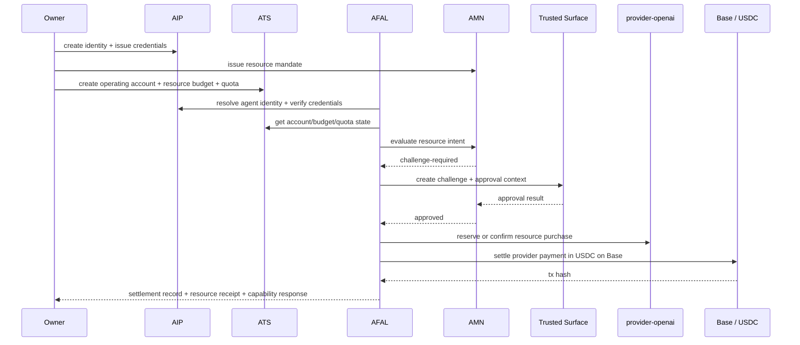

# MVP Resource Settlement Flow

## Status
Draft v0.1

## Purpose

This document defines the canonical Phase 1 AFAL resource-settlement scenario:

**agent purchases inference capacity from an approved provider and settles in USDC on Base**

It is the sibling integration spine to `mvp-agent-payment-flow.md` and aligns directly with `Resource Intent`.

This example is intentionally concrete. It uses fixed IDs, fixed timestamps, and fixed payload shapes so it can later become:

- backend mock fixtures
- SDK test fixtures
- demo script input/output
- end-to-end orchestration documentation

## Scenario Summary

A merchant-controlled research agent purchases `500000` inference tokens from `provider-openai` with a maximum spend of `18.50 USDC` on Base.

The action is allowed by identity, mandate, quota, and policy. Because the provider settlement amount exceeds the auto-settlement threshold for this class of compute purchase, AMN raises a challenge and routes the action through the trusted surface. A human approves it, after which the provider settlement is recorded and a resource receipt is produced.

## Why This Is The Canonical Phase 1 Resource Flow

This scenario exercises the full Phase 1 resource chain:

```text
Owner/Institution
  -> Agent DID + VC
  -> Resource Mandate
  -> ATS operating account + resource budget + quota
  -> Resource Intent
  -> AMN challenge / approval
  -> Provider settlement
  -> Receipt
  -> Capability response
```

It also covers the main token-economy requirement from the whitepaper:

- compute/resource budgets are first-class treasury objects
- resource purchase is modeled as a structured financial action
- challenge remains available for high-risk or policy-sensitive resource usage
- receipts and auditability exist for non-payment economic actions too

## Participants

### Human / Governance Side

- Owner: `did:afal:owner:alice-01`
- Institution: `did:afal:institution:merchant-co`

### Acting Agent

- Research agent: `did:afal:agent:research-agent-01`
- Operating account: `acct-agent-002`

### Provider

- Provider ID: `provider-openai`
- Provider DID: `did:afal:institution:provider-openai`

### Network / Asset

- Chain: `base`
- Pricing / settlement asset: `USDC`

### Resource

- Resource class: `inference`
- Resource unit: `tokens`
- Quantity: `500000`

## Module Ownership

| Step | Module | Responsibility |
|---|---|---|
| Identity creation and resolution | AIP | DIDs, bindings, credentials |
| Action permission | AMN | mandate, policy intersection, decision |
| Spend and quota capacity | ATS | account state, budget state, quota state |
| Action orchestration | AFAL | resource intent, decision wiring, settlement, receipt |
| Human approval | Trusted Surface | challenge review and approval result |

## Sequence



## Fixed Timeline

- `2026-03-24T12:00:00Z` identity, credentials, mandate, account, budget, and quota already active
- `2026-03-24T12:20:00Z` resource intent created
- `2026-03-24T12:20:05Z` AMN returns `challenge-required`
- `2026-03-24T12:22:00Z` owner approves via trusted surface
- `2026-03-24T12:23:00Z` provider purchase confirmed
- `2026-03-24T12:23:10Z` provider settlement recorded
- `2026-03-24T12:23:12Z` resource receipt and capability response emitted

## Phase 1 Preconditions

The following objects already exist and are active before the resource request starts.

### 1. Owner DID

```json
{
  "id": "did:afal:owner:alice-01",
  "subjectType": "owner",
  "status": "active",
  "controller": ["did:afal:owner:alice-01"],
  "createdAt": "2026-03-24T12:00:00Z",
  "updatedAt": "2026-03-24T12:00:00Z",
  "verificationMethods": [
    {
      "id": "key-1",
      "type": "ed25519",
      "publicKeyMultibase": "z6MkOwnerAlice01"
    }
  ]
}
```

### 2. Institution DID

```json
{
  "id": "did:afal:institution:merchant-co",
  "subjectType": "institution",
  "status": "active",
  "controller": ["did:afal:owner:alice-01"],
  "createdAt": "2026-03-24T12:00:00Z",
  "updatedAt": "2026-03-24T12:00:00Z",
  "verificationMethods": [
    {
      "id": "key-1",
      "type": "ed25519",
      "publicKeyMultibase": "z6MkMerchantCo01"
    }
  ]
}
```

### 3. Research Agent DID

```json
{
  "id": "did:afal:agent:research-agent-01",
  "subjectType": "agent",
  "status": "active",
  "controller": ["did:afal:owner:alice-01"],
  "createdAt": "2026-03-24T12:00:00Z",
  "updatedAt": "2026-03-24T12:00:00Z",
  "verificationMethods": [
    {
      "id": "key-1",
      "type": "ed25519",
      "publicKeyMultibase": "z6MkResearchAgent01"
    }
  ],
  "serviceEndpoints": [
    {
      "id": "primary-api",
      "type": "agent-api",
      "serviceEndpoint": "https://merchant.example/agents/research-agent-01"
    }
  ]
}
```

### 4. Ownership VC

```json
{
  "id": "cred-own-0002",
  "schemaVersion": "0.1",
  "type": ["VerifiableCredential", "OwnershipCredential"],
  "issuer": "did:afal:institution:merchant-co",
  "issuanceDate": "2026-03-24T12:00:00Z",
  "credentialSubject": {
    "id": "did:afal:agent:research-agent-01",
    "ownerDid": "did:afal:owner:alice-01",
    "institutionDid": "did:afal:institution:merchant-co",
    "relationshipType": "owns_and_controls",
    "agentType": "research-agent",
    "environment": "production"
  }
}
```

### 5. KYC / KYB VC

```json
{
  "id": "cred-kyc-0001",
  "schemaVersion": "0.1",
  "type": ["VerifiableCredential", "KycCredential"],
  "issuer": "did:afal:institution:kyc-provider-01",
  "issuanceDate": "2026-03-24T12:00:00Z",
  "credentialSubject": {
    "id": "did:afal:owner:alice-01",
    "kycStatus": "passed",
    "jurisdiction": "HK",
    "riskTier": "low",
    "providerRef": "prov-kyc-001"
  }
}
```

```json
{
  "id": "cred-kyb-0001",
  "schemaVersion": "0.1",
  "type": ["VerifiableCredential", "KybCredential"],
  "issuer": "did:afal:institution:kyb-provider-01",
  "issuanceDate": "2026-03-24T12:00:00Z",
  "credentialSubject": {
    "id": "did:afal:institution:merchant-co",
    "kybStatus": "passed",
    "jurisdiction": "UAE",
    "riskTier": "medium",
    "providerRef": "prov-kyb-101"
  }
}
```

### 6. Authority VC

```json
{
  "id": "cred-auth-0002",
  "schemaVersion": "0.1",
  "type": ["VerifiableCredential", "AuthorityCredential"],
  "issuer": "did:afal:institution:merchant-co",
  "issuanceDate": "2026-03-24T12:00:00Z",
  "credentialSubject": {
    "id": "did:afal:agent:research-agent-01",
    "authorityClass": "resource-only",
    "allowedActions": [
      "createResourceIntent",
      "settleResourceUsage"
    ],
    "scope": {
      "payments": false,
      "resourceSettlement": true,
      "trading": false
    }
  }
}
```

### 7. Policy VC

```json
{
  "id": "cred-policy-0002",
  "schemaVersion": "0.1",
  "type": ["VerifiableCredential", "PolicyCredential"],
  "issuer": "did:afal:institution:merchant-co",
  "issuanceDate": "2026-03-24T12:00:00Z",
  "credentialSubject": {
    "id": "did:afal:agent:research-agent-01",
    "allowedAssets": ["USDC"],
    "allowedProviders": ["did:afal:institution:provider-openai"],
    "allowedChains": ["base"],
    "challengeThreshold": "15.00"
  }
}
```

### 8. Resource Mandate

```json
{
  "mandateId": "mnd-0002",
  "schemaVersion": "0.1",
  "mandateType": "resource",
  "issuer": "did:afal:owner:alice-01",
  "subject": "did:afal:agent:research-agent-01",
  "status": "active",
  "issuedAt": "2026-03-24T12:00:00Z",
  "expiresAt": "2026-04-24T12:00:00Z",
  "scope": {
    "resourceClass": "inference",
    "allowedProviders": [
      "did:afal:institution:provider-openai"
    ],
    "dailyTokenLimit": 1000000,
    "maxSpendPerRequest": "20.00",
    "autoRefillAllowed": false
  },
  "policyRef": "cred-policy-0002",
  "challengeRules": {
    "valueThreshold": "15.00",
    "newCounterpartyRequiresChallenge": false,
    "newAssetRequiresChallenge": false,
    "newVenueRequiresChallenge": false,
    "highResourceUsageRequiresChallenge": true
  }
}
```

### 9. ATS Accounts

```json
{
  "accountId": "acct-treasury-001",
  "schemaVersion": "0.1",
  "accountType": "treasury",
  "status": "active",
  "ownerDid": "did:afal:owner:alice-01",
  "institutionDid": "did:afal:institution:merchant-co",
  "chain": "base",
  "settlementAsset": "USDC",
  "accountAddress": "0xMERCHANTTREASURY01",
  "createdAt": "2026-03-24T12:00:00Z",
  "updatedAt": "2026-03-24T12:00:00Z"
}
```

```json
{
  "accountId": "acct-agent-002",
  "schemaVersion": "0.1",
  "accountType": "operating",
  "status": "active",
  "ownerDid": "did:afal:owner:alice-01",
  "institutionDid": "did:afal:institution:merchant-co",
  "agentDid": "did:afal:agent:research-agent-01",
  "parentAccountRef": "acct-treasury-001",
  "chain": "base",
  "settlementAsset": "USDC",
  "accountAddress": "0xRESEARCHAGENT01",
  "smartAccount": {
    "standard": "erc-4337-compatible",
    "factoryRef": "acct-factory-base-01"
  },
  "freezeState": {
    "isFrozen": false,
    "reasonCode": null,
    "frozenAt": null
  },
  "createdAt": "2026-03-24T12:00:00Z",
  "updatedAt": "2026-03-24T12:00:00Z"
}
```

### 10. ATS Resource Budget

```json
{
  "budgetId": "budg-res-001",
  "budgetType": "resource",
  "subjectDid": "did:afal:agent:research-agent-01",
  "accountRef": "acct-agent-002",
  "resourceClass": "inference",
  "resourceUnit": "tokens",
  "period": "daily",
  "limitQuantity": 1000000,
  "consumedQuantity": 0,
  "availableQuantity": 1000000,
  "maxSpendAmount": "100.00",
  "pricingAsset": "USDC",
  "status": "active",
  "createdAt": "2026-03-24T12:00:00Z",
  "updatedAt": "2026-03-24T12:00:00Z"
}
```

### 11. ATS Resource Quota

```json
{
  "quotaId": "quota-001",
  "subjectDid": "did:afal:agent:research-agent-01",
  "providerId": "provider-openai",
  "providerDid": "did:afal:institution:provider-openai",
  "resourceClass": "inference",
  "resourceUnit": "tokens",
  "period": "daily",
  "maxQuantity": 1000000,
  "usedQuantity": 0,
  "status": "active",
  "createdAt": "2026-03-24T12:00:00Z",
  "updatedAt": "2026-03-24T12:00:00Z"
}
```

## Runtime Flow

### Step 1. Create Resource Intent

AFAL receives a request to purchase inference capacity from the approved provider.

```json
{
  "intentId": "resint-0001",
  "schemaVersion": "0.1",
  "intentType": "resource",
  "requester": {
    "agentDid": "did:afal:agent:research-agent-01",
    "accountId": "acct-agent-002"
  },
  "provider": {
    "providerId": "provider-openai",
    "providerDid": "did:afal:institution:provider-openai"
  },
  "resource": {
    "resourceClass": "inference",
    "resourceUnit": "tokens",
    "quantity": 500000
  },
  "pricing": {
    "maxSpend": "18.50",
    "asset": "USDC"
  },
  "budgetSource": {
    "type": "ats-budget",
    "reference": "budg-res-001"
  },
  "mandateRef": "mnd-0002",
  "policyRef": "cred-policy-0002",
  "executionMode": "pre-authorized",
  "challengeState": "required",
  "status": "created",
  "expiresAt": "2026-03-24T12:30:00Z",
  "nonce": "n-2001",
  "createdAt": "2026-03-24T12:20:00Z"
}
```

### Step 2. Resolve Identity and Capacity

Before authorization, AFAL must confirm:

- requester agent DID is active
- ownership and authority credentials are valid
- account is active and unfrozen
- resource budget can cover `500000` tokens
- provider quota allows the purchase
- max spend `18.50 USDC` is within mandate and policy boundaries

Implementation note:

- AIP validates identity and credentials
- ATS validates account, resource budget, and provider quota

### Step 3. Initial Authorization Decision

AMN evaluates the action against mandate and policy.

Reasoning:

- provider is approved
- resource class `inference` is allowed
- quantity `500000` is within daily limit `1000000`
- spend `18.50` is within `maxSpendPerRequest` `20.00`
- challenge is still required because the spend exceeds the resource challenge threshold `15.00`

```json
{
  "decisionId": "dec-1001",
  "schemaVersion": "0.1",
  "actionRef": "resint-0001",
  "actionType": "resource",
  "subjectDid": "did:afal:agent:research-agent-01",
  "mandateRef": "mnd-0002",
  "policyRef": "cred-policy-0002",
  "accountRef": "acct-agent-002",
  "result": "challenge-required",
  "challengeState": "required",
  "reasonCode": "resource-spend-above-threshold",
  "evaluatedAt": "2026-03-24T12:20:05Z",
  "expiresAt": "2026-03-24T12:30:00Z",
  "auditRef": "audit-1001"
}
```

### Step 4. Create Challenge Record

```json
{
  "challengeId": "chall-1001",
  "schemaVersion": "0.1",
  "actionRef": "resint-0001",
  "actionType": "resource",
  "subjectDid": "did:afal:agent:research-agent-01",
  "mandateRef": "mnd-0002",
  "policyRef": "cred-policy-0002",
  "state": "pending-approval",
  "reasonCode": "resource-spend-above-threshold",
  "riskSignals": [
    "high-resource-usage",
    "provider-settlement-above-threshold"
  ],
  "trustedSurfaceRef": "trusted-surface:web",
  "approvalContextRef": "ctx-1001",
  "createdAt": "2026-03-24T12:20:06Z",
  "updatedAt": "2026-03-24T12:20:06Z",
  "expiresAt": "2026-03-24T12:35:00Z"
}
```

### Step 5. Approval Context For Trusted Surface

```json
{
  "approvalContextId": "ctx-1001",
  "challengeRef": "chall-1001",
  "actionRef": "resint-0001",
  "actionType": "resource",
  "headline": "Approve inference purchase from provider-openai",
  "summary": "500000 inference tokens with max spend 18.50 USDC on Base",
  "subjectDid": "did:afal:agent:research-agent-01",
  "humanVisibleFields": {
    "requesterAccountRef": "acct-agent-002",
    "providerId": "provider-openai",
    "providerDid": "did:afal:institution:provider-openai",
    "resourceClass": "inference",
    "resourceUnit": "tokens",
    "quantity": 500000,
    "asset": "USDC",
    "maxSpend": "18.50",
    "mandateRef": "mnd-0002",
    "policyRef": "cred-policy-0002",
    "riskSignals": [
      "high-resource-usage",
      "provider-settlement-above-threshold"
    ]
  },
  "createdAt": "2026-03-24T12:20:06Z"
}
```

### Step 6. Human Approves On Trusted Surface

```json
{
  "approvalResultId": "apr-1001",
  "challengeRef": "chall-1001",
  "actionRef": "resint-0001",
  "result": "approved",
  "approvedBy": "did:afal:owner:alice-01",
  "approvalChannel": "trusted-surface:web",
  "stepUpAuthUsed": true,
  "comment": "Approved compute purchase for current research workflow",
  "approvalReceiptRef": "rcpt-approval-1001",
  "decidedAt": "2026-03-24T12:22:00Z"
}
```

### Step 7. Final Authorization Decision

```json
{
  "decisionId": "dec-1002",
  "schemaVersion": "0.1",
  "actionRef": "resint-0001",
  "actionType": "resource",
  "subjectDid": "did:afal:agent:research-agent-01",
  "mandateRef": "mnd-0002",
  "policyRef": "cred-policy-0002",
  "accountRef": "acct-agent-002",
  "result": "approved",
  "challengeState": "approved",
  "reasonCode": "approved-via-trusted-surface",
  "evaluatedAt": "2026-03-24T12:22:05Z",
  "expiresAt": "2026-03-24T12:30:00Z",
  "auditRef": "audit-1002"
}
```

### Step 8. Provider Usage Confirmation

The provider confirms that the capacity purchase is reserved or consumed for the current workflow.

```json
{
  "usageReceiptRef": "usage-1001",
  "providerId": "provider-openai",
  "providerDid": "did:afal:institution:provider-openai",
  "resourceClass": "inference",
  "resourceUnit": "tokens",
  "quantity": 500000,
  "workflowId": "wf-123",
  "taskClass": "research",
  "confirmedAt": "2026-03-24T12:23:00Z"
}
```

### Step 9. Execute Provider Settlement

AFAL records the provider settlement in USDC on Base.

```json
{
  "settlementId": "stl-1001",
  "schemaVersion": "0.1",
  "settlementType": "provider-settlement",
  "actionRef": "resint-0001",
  "decisionRef": "dec-1002",
  "sourceAccountRef": "acct-agent-002",
  "destination": {
    "providerId": "provider-openai",
    "providerDid": "did:afal:institution:provider-openai"
  },
  "asset": "USDC",
  "amount": "18.50",
  "chain": "base",
  "txHash": "0xabc123resourcehash",
  "status": "settled",
  "executedAt": "2026-03-24T12:23:05Z",
  "settledAt": "2026-03-24T12:23:10Z"
}
```

### Step 10. Emit Approval Receipt

```json
{
  "receiptId": "rcpt-approval-1001",
  "schemaVersion": "0.1",
  "receiptType": "approval",
  "actionRef": "resint-0001",
  "decisionRef": "dec-1002",
  "status": "final",
  "issuedAt": "2026-03-24T12:22:00Z",
  "evidence": {
    "challengeRef": "chall-1001",
    "approvedBy": "did:afal:owner:alice-01",
    "approvalChannel": "trusted-surface:web",
    "comment": "Approved compute purchase for current research workflow"
  }
}
```

### Step 11. Emit Resource Receipt

```json
{
  "receiptId": "rcpt-res-1001",
  "schemaVersion": "0.1",
  "receiptType": "resource",
  "actionRef": "resint-0001",
  "decisionRef": "dec-1002",
  "settlementRef": "stl-1001",
  "status": "final",
  "issuedAt": "2026-03-24T12:23:12Z",
  "evidence": {
    "providerId": "provider-openai",
    "resourceClass": "inference",
    "resourceUnit": "tokens",
    "quantity": 500000,
    "asset": "USDC",
    "amount": "18.50"
  }
}
```

### Step 12. Return Capability Response

```json
{
  "responseId": "cap-1001",
  "schemaVersion": "0.1",
  "capability": "settleResourceUsage",
  "requestRef": "req-1001",
  "actionRef": "resint-0001",
  "result": "approved",
  "decisionRef": "dec-1002",
  "challengeRef": "chall-1001",
  "settlementRef": "stl-1001",
  "receiptRef": "rcpt-res-1001",
  "message": "Resource intent approved, settled, and receipted",
  "respondedAt": "2026-03-24T12:23:12Z"
}
```

## Final State Snapshot

### Resource Intent Final Form

```json
{
  "intentId": "resint-0001",
  "schemaVersion": "0.1",
  "intentType": "resource",
  "requester": {
    "agentDid": "did:afal:agent:research-agent-01",
    "accountId": "acct-agent-002"
  },
  "provider": {
    "providerId": "provider-openai",
    "providerDid": "did:afal:institution:provider-openai"
  },
  "resource": {
    "resourceClass": "inference",
    "resourceUnit": "tokens",
    "quantity": 500000
  },
  "pricing": {
    "maxSpend": "18.50",
    "asset": "USDC"
  },
  "budgetSource": {
    "type": "ats-budget",
    "reference": "budg-res-001"
  },
  "mandateRef": "mnd-0002",
  "policyRef": "cred-policy-0002",
  "executionMode": "pre-authorized",
  "challengeState": "approved",
  "status": "settled",
  "expiresAt": "2026-03-24T12:30:00Z",
  "nonce": "n-2001",
  "createdAt": "2026-03-24T12:20:00Z",
  "decisionRef": "dec-1002",
  "challengeRef": "chall-1001",
  "usageReceiptRef": "usage-1001",
  "settlementRef": "stl-1001"
}
```

### Resource Budget Final Form

```json
{
  "budgetId": "budg-res-001",
  "budgetType": "resource",
  "subjectDid": "did:afal:agent:research-agent-01",
  "accountRef": "acct-agent-002",
  "resourceClass": "inference",
  "resourceUnit": "tokens",
  "period": "daily",
  "limitQuantity": 1000000,
  "consumedQuantity": 500000,
  "availableQuantity": 500000,
  "maxSpendAmount": "100.00",
  "pricingAsset": "USDC",
  "status": "active",
  "createdAt": "2026-03-24T12:00:00Z",
  "updatedAt": "2026-03-24T12:23:10Z"
}
```

### Resource Quota Final Form

```json
{
  "quotaId": "quota-001",
  "subjectDid": "did:afal:agent:research-agent-01",
  "providerId": "provider-openai",
  "providerDid": "did:afal:institution:provider-openai",
  "resourceClass": "inference",
  "resourceUnit": "tokens",
  "period": "daily",
  "maxQuantity": 1000000,
  "usedQuantity": 500000,
  "status": "active",
  "createdAt": "2026-03-24T12:00:00Z",
  "updatedAt": "2026-03-24T12:23:10Z"
}
```

## Implementation Notes

### Backend Step Order

1. `AFAL.createResourceIntent`
2. `AIP.resolveIdentity`
3. `AIP.verifyCredential`
4. `ATS.getAccountState`
5. `ATS.getBudgetState`
6. `ATS.getResourceQuota`
7. `AMN.evaluateAuthorization`
8. if challenged: `AMN.createChallengeRecord`
9. `TrustedSurface.getApprovalContext`
10. `TrustedSurface.approveChallenge`
11. `AMN.recordAuthorizationDecision`
12. `AFAL.executeResourceIntent`
13. `AFAL.settleResourceUsage`
14. `AFAL.createSettlementRecord`
15. `AFAL.createReceipt`
16. `AFAL.respondToCapabilityInvocation`

### What This Example Freezes

- first Phase 1 provider-settlement chain: Base
- first Phase 1 provider-settlement asset: USDC
- first Phase 1 resource class: inference tokens
- first approved provider example: `provider-openai`
- first resource audit artifact set: decision + challenge + settlement + receipt + capability response

### What This Example Does Not Freeze

- exact provider adapter protocol
- exact off-chain usage metering implementation
- whether provider usage is prepaid or postpaid in later phases
- future conversion between stablecoin and provider credits
- future multi-provider routing

## Minimal Acceptance Criteria

This example is correctly implemented when:

- no step needs an undefined schema object
- every `Ref` resolves to a defined object type
- the action can be blocked before provider settlement if challenge is rejected
- resource budget and provider quota update only after approved execution
- the final output includes decision, settlement, and receipt objects

## Immediate Follow-On Work

- add mock request/response fixtures under `sdk/` or `backend/`
- add minimal AFAL orchestration interface signatures for resource flows
- add fixture-backed integration tests for this resource path
- align payment and resource examples into one demo script
